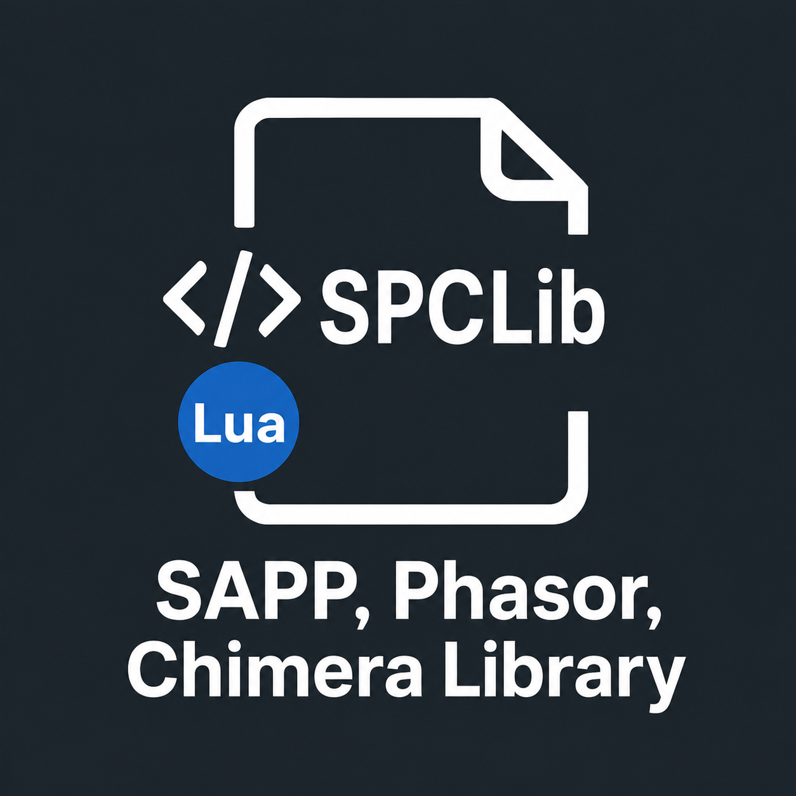

  

   

  

  

  

 

---

**Educational Content Moved:** All my Halo guides, tutorials, code snippets, and reference materials have moved to my
personal website. Visit [chalwk.github.io](https://chalwk.github.io/blog) for articles on SAPP scripting, VPS hosting,
port forwarding, memory offsets, and more. **All SAPP/Phasor Lua scripts are still available here.**

---

## Table of Contents

* [1. Overview](#overview)
* [2. What are SAPP, Phasor and Chimera?](#what-are-sapp-phasor-and-chimera)
* [3. Scripts, Releases and Knowledge Base](#scripts-releases-and-knowledge-base)
* [4. Community Favorites](#community-favorites)
* [5. Integration Tools](#integration-tools)
    * [5.1 SAPPDiscordBot](#sappdiscordbot)
* [6. Contributors, Community Guidelines & Request Features](#contributors-community-guidelines--request-features)
    * [6.1 Submit Ideas](#submit-ideas)
    * [6.2 Report Issues](#report-issues)
* [7. Halo Custom Edition Installer](#halo-custom-edition-installer)
    * [7.1 LAA Patched Executables](#laa-patched-executables)
* [8. Community Hubs](#community-hubs)
* [9. Shoutout to Clans (Past and Present)](#shoutout-to-clans-past-and-present)
* [10. Support My Work](#support-my-work)

---

## Overview

**SPCLib** (SAPP, Phasor and Chimera Library) is the largest public archive of Lua scripts and resources for the
**SAPP** and **Phasor** dedicated server extensions, and the **Chimera** client-side mod (which also supports Lua
scripting), for Halo PC and Custom Edition.

If you are a server administrator or operator using SAPP, Phasor, or Chimera, you will find a wide range of scripts,
guides, and insights to enhance, customize, and extend your multiplayer server experience.

---

## What are SAPP, Phasor and Chimera?

**SAPP** and **Phasor** are server-side extensions for `haloded.exe`/`haloceded.exe` that provide advanced scripting and
customization capabilities for dedicated servers.

**SAPP** was developed by sehé and is the most feature-rich and widely used extension. It provides powerful Lua
scripting support, anti-cheat tools, event hooks, command handling, player management, logging, and numerous
under-the-hood features.

**Phasor** is an extension with similar goals.

SAPP and Phasor are no longer actively maintained, but stable and complete in their final released versions.

**[Chimera](https://github.com/SnowyMouse/chimera)** is a client-side mod for Halo Custom Edition, PC, and Trial that
also exposes a Lua API. Developed by SnowyMouse, it is actively maintained and provides event hooks,
commands, built-in map downloads, and dozens of quality-of-life fixes. Chimera scripts are fully supported in SPCLib.

---

## Scripts, Releases and Knowledge Base

| Category                                                           | Description                                                              |
|--------------------------------------------------------------------|--------------------------------------------------------------------------|
| [**SAPP Scripts**](./sapp)                                         | Attractive, Custom Games, Libraries, Utilities                           |
| [**Phasor Scripts**](./phasor)                                     | Phasor Scripts                                                           |
| [**Chimera Scripts**](./chimera)                                   | Chimera Scripts                                                          |
| [**Releases**](https://github.com/Chalwk/SPCLib/releases)          | Larger SAPP projects with advanced functionality beyond standard scripts |
| [**Knowledge Base (docs)**](https://chalwk.github.io/blog/#page-1) | Documentation and community knowledge base                               |

---

## Community Favorites

Click to expand (popular SAPP scripts)

| Category         | Script                                                                |
|------------------|-----------------------------------------------------------------------|
| **Attractive**   | [Capture The Flag](./sapp/attractive/capture_the_flag.lua)            |
|                  | [Custom Teleports](./sapp/attractive/custom_teleports.lua)            |
|                  | [Deployable Mines](./sapp/attractive/deployable_mines.lua)            |
|                  | [Rank System](./sapp/attractive/rank_system.lua)                      |
|                  | [Sprint System](./sapp/attractive/sprint_system.lua)                  |
|                  | [Tactical Insertion](./sapp/attractive/tactical_insertion.lua)        |
|                  | [Tea Bagging](./sapp/attractive/tea_bagging.lua)                      |
|                  | [Uber](./sapp/attractive/uber.lua)                                    |
|                  | [Vanish](./sapp/attractive/vanish.lua)                                |
| **Custom Games** | [Divide and Conquer](./sapp/custom_games/divide_and_conquer.lua)      |
|                  | [Gun Game](./sapp/custom_games/gun_game.lua)                          |
|                  | [Kill Confirmed](./sapp/custom_games/kill_confirmed.lua)              |
|                  | [Melee Attack](./sapp/custom_games/melee_attack.lua)                  |
|                  | [One In The Chamber](./sapp/custom_games/one_in_the_chamber.lua)      |
|                  | [Snipers Dream Team](./sapp/custom_games/snipers_dream_team.lua)      |
|                  | [Tag](./sapp/custom_games/tag.lua)                                    |
|                  | [Zombies Standard](./sapp/custom_games/zombies_standard.lua)          |
|                  | [Zombies Advanced](./sapp/custom_games/zombies_advanced.lua)          |
| **Utility**      | [AFK System](./sapp/utility/afk_system.lua)                           |
|                  | [Anti Impersonator](./sapp/utility/anti_impersonator.lua)             |
|                  | [Auto Message](./sapp/utility/auto_message.lua)                       |
|                  | [Custom Loadouts](./sapp/utility/custom_loadouts.lua)                 |
|                  | [Delay Skip](./sapp/utility/delay_skip.lua)                           |
|                  | [Dynamic Ping Kicker](./sapp/utility/dynamic_ping_kicker.lua)         |
|                  | [Dynamic Score Limit](./sapp/utility/dynamic_score_limit.lua)         |
|                  | [Liberty Vehicle Spawner](./sapp/utility/liberty_vehicle_spawner.lua) |
|                  | [Notify Me](./sapp/utility/notify_me.lua)                             |
|                  | [Race Assistant](./sapp/utility/race_assistant.lua)                   |
|                  | [Server Logger](./sapp/utility/server_logger.lua)                     |
|                  | [Team Shuffler](./sapp/utility/team_shuffler.lua)                     |
|                  | [Weapon Assigner](./sapp/utility/weapon_assigner.lua)                 |
|                  | [Word Buster](./sapp/utility/word_buster.lua)                         |

---

## Integration Tools

### SAPPDiscordBot

A Java application that uses the [JDA API](https://github.com/discord-jda/JDA) to connect Halo SAPP server events to
Discord, providing real-time alerts, structured embeds, and a GUI interface for monitoring your servers.

**Features:**

- Real-time event monitoring for multiple Halo servers
- Rich Discord embeds with customizable templates
- GUI interface for easy configuration
- Support for all SAPP event types (joins, deaths, scores, chat, etc.)
- Cross-platform (Windows & Linux)

**[→ Visit SAPPDiscordBot Repository](https://github.com/Chalwk/SAPPDiscordBot)**

---

## Contributors, Community Guidelines & Request Features

See our [Contributing Guide](https://github.com/Chalwk/SPCLib/blob/master/CONTRIBUTING.md) to learn how to
get involved.

All community interactions are governed by
our [Code of Conduct](https://github.com/Chalwk/SPCLib/blob/master/CODE_OF_CONDUCT.md)

### Submit Ideas

Have an idea for a new feature or script?  
[Submit Feature Request](https://github.com/Chalwk/SPCLib/issues/new?template=FEATURE_REQUEST.yaml)

### Report Issues

- [Bug Report Form](https://github.com/Chalwk/SPCLib/issues/new?assignees=Chalwk&labels=Bug%2CNeeds+Triage&projects=&template=BUG_REPORT.yaml&title=%5BBUG%5D+%3Ctitle%3E)
- [Feature Request Form](https://github.com/Chalwk/SPCLib/issues/new?assignees=Chalwk&labels=Feature%2CNeeds+Review&projects=&template=FEATURE_REQUEST.yaml&title=%5BFEATURE%5D+%3Ctitle%3E)

---

## Halo Custom Edition Installer:

**Note:** You need your own CD Key to install this.

[halo_ce_installer.zip](https://drive.google.com/file/d/1TTiBYhO9JS5Js0exRlygH9pAC2yV1KsV/view?usp=sharing)  
[haloce-patch-1.0.10.zip](https://drive.google.com/file/d/1CIPg3XZ3VIm4ngUnDqLCRNSn9x-jxD6W/view?usp=drive_link)

### LAA Patched Executables

These are Large Address Aware (LAA) patched versions of Halo executables, allowing the game to use more than 2 GB of RAM
on 64-bit systems:

- [Download Page](https://github.com/Chalwk/SPCLib/releases/tag/laa_patched)

---

## Community Hubs

| Hub Name            | Link(s)                                                                                                                                          | Description                                                                                                                                                                                                                                                                                                                                                                                |
|:--------------------|:-------------------------------------------------------------------------------------------------------------------------------------------------|:-------------------------------------------------------------------------------------------------------------------------------------------------------------------------------------------------------------------------------------------------------------------------------------------------------------------------------------------------------------------------------------------|
| **Chalwk (SPCLib)** | [Website](https://chalwk.github.io/) \| [Discord](https://discord.gg/D76H7RVPC9)                                                                 | Personal website and portfolio of Chalwk. The site serves as a playground for educational content (including Halo-related tutorials on the [blog page](https://chalwk.github.io/blog/)), as well as PWA web tools and apps. Only about 20% of the content is Halo-specific. The Discord server is a community hub for discussion, support, and collaboration on SPCLib and Halo scripting. |
| **Open Carnage**    | [Website](https://opencarnage.net) \| [Discord](https://discord.gg/2pf3Yjb)                                                                      | Open Carnage was a long-running forum and resource for Halo Custom Edition and MCC modding. The community entered a read-only state in 2023 following persistent DDoS attacks, which also resulted in the loss of a significant amount of content. It was considered one of the last major Halo CE modding forums.                                                                         |
| **Chimera**         | [Forum Thread](https://opencarnage.net/index.php?/topic/6916-chimera-download-source-code-and-discord/) \| [Discord](https://discord.gg/ZwQeBE2) | Chimera is an essential client-side mod for Halo Custom Edition, PC "Retail", and Trial. Often described as "the update to Halo PC that never was," it extends game limits, addresses renderer issues, and applies dozens of fixes and quality-of-life improvements, such as built-in map downloads.                                                                                       |
| **Halo Net**        | [Website](https://halonet.net/)                                                                                                                  | HaloNet.Net is a central hub for Halo PC modding, primarily known for hosting the massive HAC2 map repository and update servers. The repository contains thousands of custom maps totaling many gigabytes of content, which are automatically downloaded by HAC2 and Chimera when joining a server.                                                                                       |
| **XG Gaming**       | [Website](https://www.xgclan.com) (archived)                                                                                                     | **XG Gaming** (also known as **Extreme Gaming**) was a clan community for Halo PC/CE and other online games. According to archived snapshots of their now-defunct website, they provided forums, server listings, clan information, and downloads. The original domain is no longer active, but historical records can be viewed via the Wayback Machine.                                  |
| **POQ Clan**        | [Website](http://poqclan.com/)                                                                                                                   | The Players of Quality (PÕQ) Clan is one of the oldest and largest Halo PC/CE clans, established in 2006. They maintain 19 dedicated public servers, some of which feature custom modifications like extra portals, no falling damage, powered snipers, and flying warthogs. Many of their servers are rated among the most popular on Halo PC/CE.                                         |
| **BK (BlacksHalo)** | [Website](https://www.blackshalo.com)                                                                                                            | Blackshalo (BK) is a well-known clan in the Halo PC community, having run original and popular servers for both Custom Edition and Combat Evolved for over 15 years. They are recognized as one of the biggest and best-known clans in Halo, and their website provides forums for news, general topics, and server administration.                                                        |
| **Liberty**         | [Discord](https://discord.gg/3J2Zppghz5)                                                                                                         | Liberty is an active Halo Custom Edition community founded in 2024. They host servers for classic and custom maps, including CTF, Slayer, Oddball, and a dedicated Racing server. The community emphasizes fair play, custom content, and friendly social interaction, with Discord used for events, server alerts, and player coordination.                                               |
| **Reclaimers**      | [Website](https://c20.reclaimers.net/) \| [Discord](https://discord.reclaimers.net/)                                                             | The Reclaimers Library (c20) is a comprehensive, community-maintained wiki and resource hub for Halo modding. It documents the tribal knowledge of the modding community for Halo Custom Edition and the MCC mod tools for all mainline titles, serving as a repository of guides, tool documentation, and technical references.                                                           |
| **Realworld CE**    | [Website](https://www.realworldce.com/)                                                                                                          | Realworld CE is a guild and custom map blog for Halo Custom Edition. The site hosts hundreds of multiplayer custom maps (no single-player or AI maps), many of which are played on the guild’s own dedicated servers. Maps can be downloaded individually or in packs at full speed, and some maps are exclusive to this site. The blog is maintained by Harbinge® and Dwight®.            |

---

## Shoutout to Clans (Past and Present)

> \- YAS -, -db-, «§», «Ag~, «Ð²Ä», «MAD», [Aķ], [CV], [GTV], [HGE], [IG], [IS], [K2], [McK], [Nbk], [VR], [WFFF], ]
> ZTA[. VSA, {ATP}, {BK}, {CK}, {CRG}, {HWS}, {LoH}, {NR}, {OTH}, {ØZ}, {PWH}, {SK}, {SSC}, {V3}, {X}, {XF} = SL =,
> {XG}, = EP =, = NcS =, = XA=, =DN=, =RDA=, £V», ÄÄÄ, AOD, AR, BR, BZ, C#w, CAF, CB, CES, CGD, CHr, CK, ÇM, CODE, CSI,
> CST, DFS, DR, Ðu¥, EK, ev, FCM, Fem1, Fez`, FIG, FooK, GDS, GoD, GRO, HH, HSF, HTK3, IR, KB, KMT, KoD, KoF, LaG, LF,
> LIB, LNZ, LP, LTD2, M5, MR, MVL, ňc, ÑE», ñuß, OSR, OWV, P§ycho, PÕQ, PRO, RC, RSF, SAR, SB, SDR, ßE, TBR, TCS, TFT,
> TM, ToR, X¬, xOSHx, xT

---

## Support My Work

Enjoy these projects? Help me continue development:

- ☕ [Donate via PayPal](https://www.paypal.com/ncp/payment/XUPTKDU6LKM3G)
- **Star ⭐ this repository** to show appreciation and stay updated!