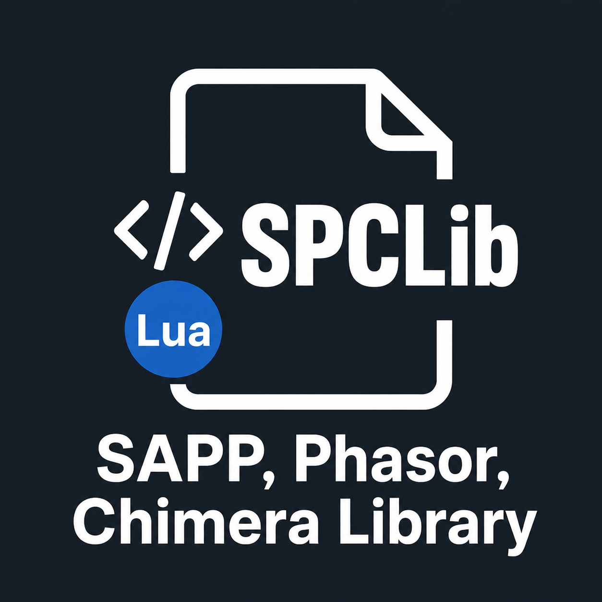

<div align="center">
  

  <br>

  <a href="mailto:chalwk.dev@gmail.com">
    
  </a>

  <a href="https://discord.gg/D76H7RVPC9">
    
  </a>

  <a href="https://chalwk.github.io/">
    
  </a>
</div>

<br>

---

## Table of Contents

* [1. Overview](#overview)
* [2. What are SAPP, Phasor and Chimera?](#what-are-sapp-phasor-and-chimera)
* [3. Scripts, Releases and Knowledge Base](#scripts-releases--knowledge-base)
* [4. SAPP Archive & Mirrors](#sapp-archive--mirrors)
* [5. SPCLib Web Tools & Home Page](#spclib-web-tools--home-page)
* [6. Halo Custom Edition Installer](#halo-custom-edition-installer)
    * [6.1 LAA Patched Executables](#laa-patched-executables)
* [7. Community Hubs](#community-hubs)
* [8. Shoutout to Clans (Past and Present)](#shoutout-to-clans-past-and-present)
* [9. Contributors, Community Guidelines & Request Features](#contributors-community-guidelines--request-features)
* [10. Support My Work](#support-my-work)
* [11. Ban Appeals](#ban-appeals)
* [12. License](#license)

---

## Overview

**SPCLib** *(SAPP, Phasor and Chimera Library)* is the largest public archive of Lua scripts and resources for the SAPP
and Phasor dedicated server extensions and the Chimera client-side mod for Halo PC and Custom Edition. All Lua scripts
in SPCLib are written and curated by Chalwk, unless otherwise noted.

Here, you will find a wide range of scripts, guides, and insights to enhance, customize, and extend your multiplayer
server experience.

---

## What are SAPP, Phasor and Chimera?

**SAPP** and **Phasor** are server-side extensions for `haloded.exe`/`haloceded.exe` that provide advanced scripting and
customization capabilities for dedicated servers.

**SAPP** was developed by sehé and is the most feature-rich and widely used extension. It provides powerful Lua
scripting support, anti-cheat tools, event hooks, command handling, player management, logging, and numerous
under-the-hood features.

**Phasor** is an earlier extension with similar goals.

SAPP and Phasor are no longer actively maintained, but stable and complete in their final released versions.

**[Chimera][chimera]** is a client-side mod for Halo Custom Edition, PC, and Trial that
also exposes a Lua API. Developed by SnowyMouse, it is actively maintained and provides event hooks, commands, built-in
map downloads, and dozens of quality-of-life fixes. Chimera scripts are fully supported in SPCLib.

---

## Scripts, Releases & Knowledge Base

> [!NOTE]
> Start with the category that matches your setup: **SAPP** or **Phasor** for server-side scripting, or **Chimera** for
> client-side scripting.

### Script Category Structure

SAPP & Phasor Lua scripts are organized into the following categories:

* **admin:** Strictly moderation & enforcement (bans, kicks, anti-cheat, rule enforcement)
* **chat:** Chat formatting, messages, and command handling
* **gameplay:** Gameplay mechanics, modifiers, and fun items
* **gametypes:** Custom game modes and gametype variations
* **modules:** Library modules for other scripts
* **notifications:** Console output, timers, and event alerts
* **utility:** Server configuration, spawning, map control, and miscellaneous tools

| Section                           | Resource                                                     | Description                                                                                     |
|-----------------------------------|--------------------------------------------------------------|-------------------------------------------------------------------------------------------------|
| **Scripts & Releases**            | [**SAPP Scripts**][sapp_scripts]                             | Server-side Lua scripts                                                                         |
|                                   | [**Phasor Scripts**][phasor_scripts]                         | Server-side Lua scripts                                                                         |
|                                   | [**Chimera Scripts**][chimera_scripts]                       | Client-side Lua scripts.                                                                        |
|                                   | [**Script Packages**][releases]                              | Bundled projects with multiple files and resources available as downloadable ZIP packages.      |
| **Server Setup & Hosting**        | [**How to Host a Linux VPS (Ubuntu 22.04)**][vps_host_guide] | Full setup with Wine, VNC, firewall, SSH, and fail2ban.                                         |
|                                   | [**Server Port Forwarding**][port_forwarding]                | Router configuration for UDP ports 2302 & server port, plus firewall rules for Windows/Linux.   |
|                                   | [**SAPP Server Guide**][sapp_server_guide]                   | Pre-configured package walkthrough covering file structure, launch, and multi-server expansion. |
| **Scripting Guides & References** | [**Scripting with SAPP**][scripting_with_sapp]               | Server-side Lua API: signature scanning, globals, and core functions.                           |
|                                   | [**Scripting with Phasor**][scripting_with_phasor]           | Server-side Lua scripting with version handling and hardcoded addresses.                        |
|                                   | [**Scripting with Chimera**][scripting_with_chimera]         | Client-side Lua scripting with event callbacks, script placement, and version compatibility.    |
|                                   | [**SAPP Command Reference**][sapp_command_ref]               | Complete reference for SAPP server commands, admin levels, and usage.                           |
|                                   | [**Common Lua References**][lua_common_ref]                  | Common Lua patterns, utilities, and helpers for Halo server/client scripting.                   |
|                                   | [**Understanding Memory Offsets**][memory_offsets]           | Addresses, offsets, signature scanning, and tools for Halo PC/CE.                               |
|                                   | [**Modding References**][modding_refs]                       | Tag editing, map rebuilding, asset injection, and community tooling references.                 |

---

## SAPP Archive & Mirrors

<details>
<summary>📦 Archival SAPP binaries and documentation (click to expand)</summary>

The official SAPP website (halo.isimaginary.com) is no longer accessible. To ensure historical versions remain
available, this repository mirrors all released SAPP binaries.

You'll find the full archive of SAPP versions in the **[`./assets/sapp_downloads`][sapp_downloads_dir]** folder.

This repository also preserves:

- SAPP Documentation Revision 2.4 and 2.5 (by 002 / SnowyMouse)
- Memory offsets reference list originally created by Wizard

**These documents and binaries are redistributed for preservation only. Licensing remains with their original authors.**

</details>

---

## SPCLib Web Tools & Home Page

> [!NOTE]
> The [SPCLib Home Page](https://chalwk.github.io/SPCLib/) brings together integrated tools, the ban registry, and
> a quick overview of the project in one place.

[](https://chalwk.github.io/SPCLib/)

The home page provides direct access to:

- **Script Browser** - Live search and filtering of all SPCLib scripts.
- **Alias Browser** - Standalone interface for `alias_system.lua` (IP/hash tracking).
- **Rank Browser** - Standalone interface for `rank_system.lua`.
- **Ban Registry** - Public record of active, expired, and revoked bans.
- **HaloDiscordBot** - Java application linking Halo servers to Discord.

Use the home page as a central dashboard to explore tools and community resources without leaving your browser.

---

## Halo Custom Edition Installer

> [!NOTE]
> You must own a valid CD key to install Halo Custom Edition.

[halo_ce_installer.zip][halo_ce_installer]  
[haloce-patch-1.0.10.zip][haloce_patch]

### LAA Patched Executables

> [!NOTE]
> Large Address Aware (LAA) patches allow Halo to use more than 2 GB of RAM on 64-bit systems.

[Download Page][laa_patched]

---

## Community Hubs

<details>
<summary>🌐 Active and legacy Halo PC/CE communities (click to expand)</summary>

> Community activity varies across hubs. Some are active, others are legacy archives.

| Hub                                                                                | Description                                                                                 |
|------------------------------------------------------------------------------------|---------------------------------------------------------------------------------------------|
| **Chalwk** - [Website][chalwk_website] · [Discord][spclib_discord]                 | Personal site & portfolio.                                                                  |
| **Open Carnage** - [Website][opencarnage_website] · [Discord][opencarnage_discord] | Former major CE modding forum (now read‑only after DDoS attacks).                           |
| **Chimera** - [Forum][chimera_forum] · [Discord][chimera_discord]                  | Essential client‑side mod with map downloads, renderer fixes, quality‑of‑life improvements. |
| **Halo Net** - [Website][halonet_website]                                          | HAC2 map repository & update server - auto‑downloads thousands of custom maps.              |
| **XG Gaming** - [Website][xg_website] (archived)                                   | Former clan community (servers, forums, downloads); domain now offline.                     |
| **POQ Clan** - [Website][poq_website]                                              | One of the oldest Halo PC/CE clans (2006) with 19 public servers & custom mods.             |
| **BK (BlacksHalo)** - [Website][bk_website]                                        | Well‑known clan running popular servers for 15+ years.                                      |
| **Liberty** - [Discord][liberty_discord]                                           | Active CE community (founded 2024) hosting CTF, Slayer, Oddball, Racing servers.            |
| **Reclaimers** - [Website][reclaimers_website] · [Discord][reclaimers_discord]     | Community wiki & resource hub for Halo CE and MCC modding tools.                            |
| **Realworld CE** - [Website][realworld_website]                                    | Guild & custom map blog offering hundreds of exclusive multiplayer maps.                    |

</details>

---

## Shoutout to Clans (Past and Present)

<details>
<summary>🎖️ Honouring Halo PC/CE clans across decades (click to expand)</summary>

This list represents historical and current Halo PC/CE clans and communities over many years of multiplayer history.

```
\- YAS -, -db-, «§», «Ag~, «Ð²Ä», «MAD», [Aķ], [CV], [GTV], [HGE], [IG], [IS], [K2], [McK], [Nbk], [VR], [WFFF], ]
ZTA[. VSA, {ATP}, {BK}, {CK}, {CRG}, {HWS}, {LoH}, {NR}, {OTH}, {ØZ}, {PWH}, {SK}, {SSC}, {V3}, {X}, {XF} = SL =,
{XG}, = EP =, = NcS =, = XA=, =DN=, =RDA=, £V», ÄÄÄ, AOD, AR, BR, BZ, C#w, CAF, CB, CES, CGD, CHr, CK, ÇM, CODE, CSI,
CST, DFS, DR, Ðu¥, EK, ev, FCM, Fem1, Fez`, FIG, FooK, GDS, GoD, GRO, HH, HSF, HTK3, IR, KB, KMT, KoD, KoF, LaG, LF,
LIB, LNZ, LP, LTD2, M5, MR, MVL, ňc, ÑE», ñuß, OSR, OWV, P§ycho, PÕQ, PRO, RC, RSF, SAR, SB, SDR, ßE, TBR, TCS, TFT,
TM, ToR, X¬, xOSHx, xT
```

</details>

---

## Contributors, Community Guidelines & Request Features

Contributions, bug reports, and feature requests are welcome via GitHub issues and discussion templates.

See the [Contributing Guide](CONTRIBUTING.md). All community interaction is governed by
the [Code of Conduct](CODE_OF_CONDUCT.md)

### Submit Ideas

[Submit Feature Request][feature_request]

### Report Issues

- [Bug Report][bug_report]
- [Feature Request][feature_request]

---

## Support My Work

Enjoy these projects? Help me continue development:

- ☕ [Donate via PayPal][paypal_donate]
- **Star ⭐ this repository** to show appreciation and stay updated!

---

## Ban Appeals

<details>
<summary>If you believe you have been banned in error from the **SPCLib Discord or Halo servers**, you may submit a formal appeal.</summary>

* [Submit a Ban Appeal][ban_appeal_template]
* [List of active bans][bans]

</details>

---

## License

> [!CAUTION]
> Halo is a trademark of Microsoft. This project is not affiliated with or endorsed by Microsoft or its subsidiaries,
> including Halo Studios (formerly 343 Industries).

**[SPCLib][repo_homepage]** is licensed under the [MIT License](LICENSE).

---

[alias_browser_badge]: https://img.shields.io/badge/Alias_Browser-Open_Now-7289DA?style=for-the-badge&logo=google-chrome&logoColor=white

[alias_browser]: https://chalwk.github.io/SPCLib/tools/alias-browser.html

[ban_appeal_template]: https://github.com/Chalwk/SPCLib/issues/new?template=BAN_APPEAL.yaml

[bans]: https://chalwk.github.io/SPCLib/tools/bans.html

[bk_website]: https://www.blackshalo.com

[bug_report]: https://github.com/Chalwk/SPCLib/issues/new?assignees=Chalwk&labels=Bug%2CNeeds+Triage&template=BUG_REPORT.yaml

[chalwk_website]: https://chalwk.github.io/

[chimera_discord]: https://discord.gg/ZwQeBE2

[chimera_forum]: https://opencarnage.net/index.php?/topic/6916-chimera-download-source-code-and-discord/

[chimera_scripts]: ./chimera

[chimera]: https://github.com/SnowyMouse/chimera

[feature_request]: https://github.com/Chalwk/SPCLib/issues/new?template=FEATURE_REQUEST.yaml

[halo_ce_installer]: https://drive.google.com/file/d/1TTiBYhO9JS5Js0exRlygH9pAC2yV1KsV/view?usp=sharing

[halo_discord_bot_badge]: https://img.shields.io/badge/HaloDiscordBot-Repository-5865F2?style=for-the-badge&logo=discord&logoColor=white

[halodiscordbot_repo]: https://github.com/Chalwk/HaloDiscordBot

[haloce_patch]: https://drive.google.com/file/d/1CIPg3XZ3VIm4ngUnDqLCRNSn9x-jxD6W/view?usp=drive_link

[halonet_website]: https://halonet.net/

[laa_patched]: https://github.com/Chalwk/SPCLib/releases/tag/laa_patched

[liberty_discord]: https://discord.gg/3J2Zppghz5

[lua_common_ref]: https://chalwk.github.io/blog/2026/05/17/halo-lua-common-references

[memory_offsets]: https://chalwk.github.io/blog/2025/09/08/halo-understanding-memory-offsets

[modding_refs]: https://chalwk.github.io/blog/2025/09/08/halo-modding-references/

[opencarnage_discord]: https://discord.gg/2pf3Yjb

[opencarnage_website]: https://opencarnage.net

[paypal_donate]: https://www.paypal.com/ncp/payment/XUPTKDU6LKM3G

[phasor_scripts]: ./phasor

[poq_website]: http://poqclan.com/

[port_forwarding]: https://chalwk.github.io/blog/2025/09/01/halo-server-port-forwarding/

[rank_browser_badge]: https://img.shields.io/badge/Rank_Browser-Open_Now-7289DA?style=for-the-badge&logo=google-chrome&logoColor=white

[rank_browser]: https://chalwk.github.io/SPCLib/tools/rank-browser.html

[realworld_website]: https://www.realworldce.com/

[reclaimers_discord]: https://discord.reclaimers.net/

[reclaimers_website]: https://c20.reclaimers.net/

[releases]: https://github.com/Chalwk/SPCLib/releases

[repo_homepage]: https://github.com/Chalwk/SPCLib

[sapp_command_ref]: https://chalwk.github.io/blog/2026/05/17/halo-sapp-command-reference

[sapp_downloads_dir]: ./assets/sapp_downloads

[sapp_scripts]: ./sapp

[sapp_server_guide]: https://chalwk.github.io/blog/2026/04/03/halo-sapp-server-guide/

[script_browser_badge]: https://img.shields.io/badge/Script_Browser-Open_Now-7289DA?style=for-the-badge&logo=google-chrome&logoColor=white

[script_browser]: https://chalwk.github.io/SPCLib/tools/script-browser.html

[scripting_with_chimera]: https://chalwk.github.io/blog/2026/05/17/halo-scripting-with-chimera

[scripting_with_phasor]: https://chalwk.github.io/blog/2026/05/17/halo-scripting-with-phasor

[scripting_with_sapp]: https://chalwk.github.io/blog/2026/05/17/halo-scripting-with-sapp

[spclib_discord]: https://discord.gg/D76H7RVPC9

[vps_host_guide]: https://chalwk.github.io/blog/2025/08/29/halo-how-to-host-a-ubuntu-vps/

[xg_website]: https://www.xgclan.com
